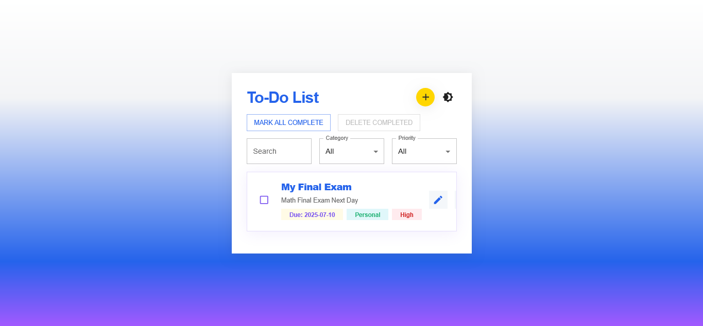
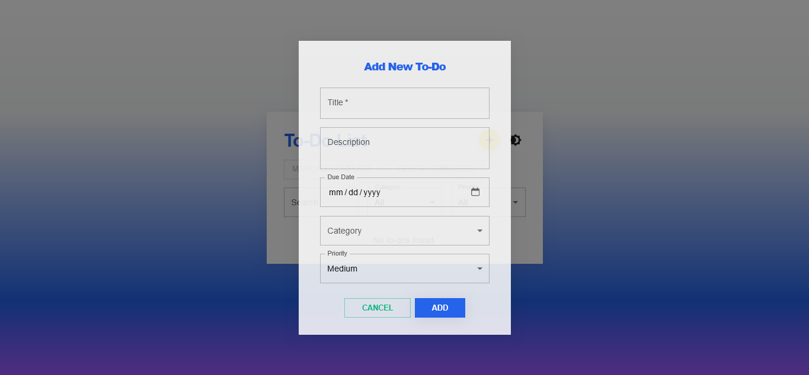
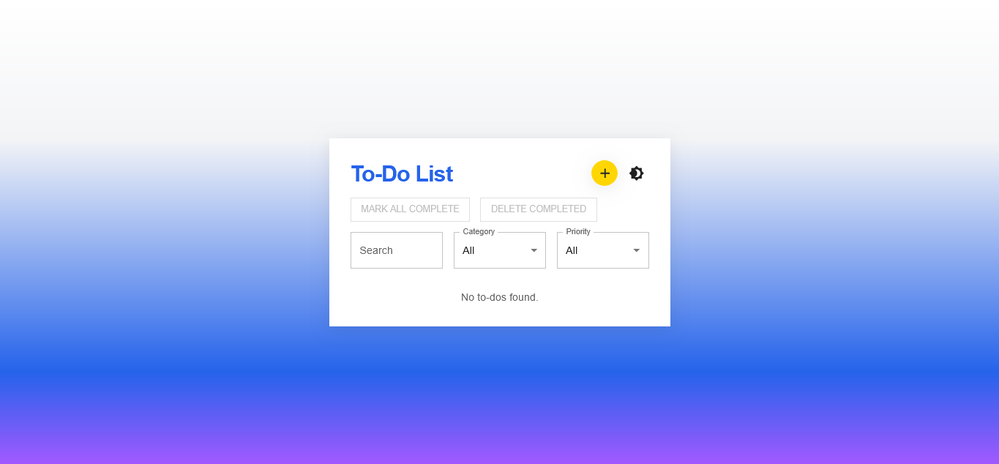

# 📝 Modern To-Do List App

A beautiful, modern, and user-friendly to-do list application built with **React** and **Material-UI**.  
This app is designed for productivity, premium aesthetics, and ease of use—perfect for anyone who wants to manage tasks in style.

---
## 📸 Screenshots





## ✨ Features

- **Modern, Responsive UI:**  
  Clean, premium design with a white-to-gradient background, dark mode, and a focus on usability.

- **Add, Edit, Delete Tasks:**  
  Quickly add new tasks with the prominent yellow "+" button, edit or delete with a single click.

- **Task Details:**  
  Each to-do can have a title, description, due date, category, and priority.

- **Bulk Actions:**  
  Mark all tasks as complete or delete all completed tasks with one click.

- **Search & Filter:**  
  Instantly search and filter tasks by category or priority.

- **Dark & Light Mode:**  
  Toggle between beautiful light and night-friendly dark themes.

- **Persistent Storage:**  
  All your tasks are saved in your browser (localStorage), so you never lose your list.

- **Accessible & Mobile-Friendly:**  
  Large touch targets, clear color contrast, and a responsive layout for all devices.

---

## 🚀 Getting Started

1. **Clone the repository:**
   ```bash
   git clone https://github.com/your-username/your-repo-name.git
   cd your-repo-name
   ```

2. **Install dependencies:**
   ```bash
   npm install
   ```

3. **Start the development server:**
   ```bash
   npm start
   ```
   or
   ```bash
   npm run dev
   ```

---

## 🛠️ Built With

- [React](https://react.dev/)
- [Material-UI (MUI)](https://mui.com/)
- [Vite](https://vitejs.dev/)

---

## 📄 License

This project is open source and available under the [MIT License](LICENSE).

